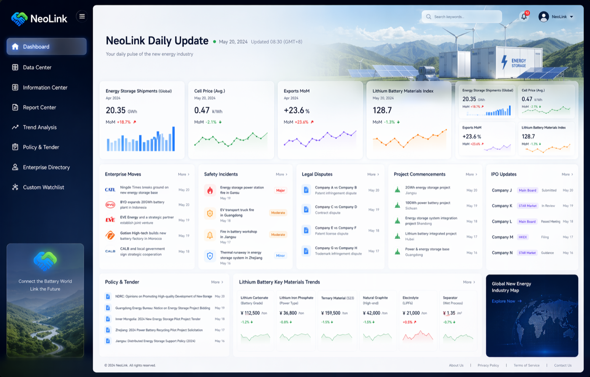
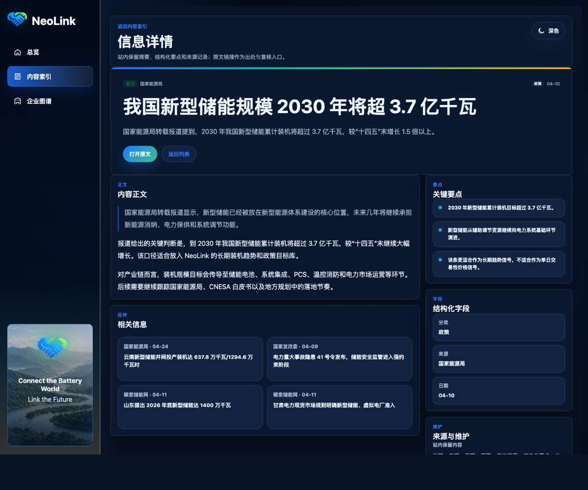
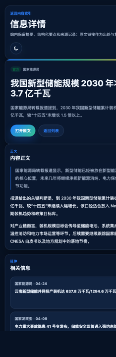
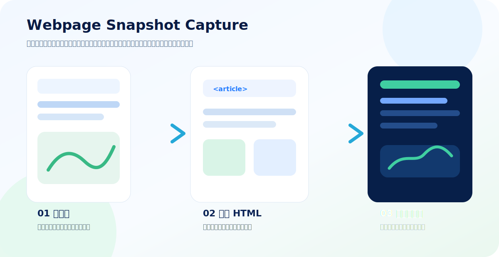
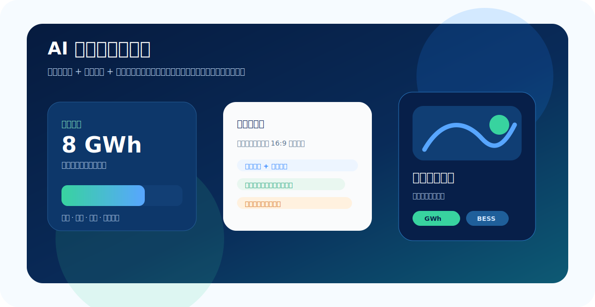

# NeoLink 新能源产业情报站

NeoLink 是一个面向新能源、储能与锂电产业的静态情报网站。它用于承载每日头条、最新新闻、核心指标、企业图谱和站内正文详情，重点解决两个问题：

- 高频信息需要快速更新、快速浏览。
- 外部链接可能失效，站内需要保留可读摘要、结构化字段、正文 HTML 和来源记录。



## 内容范围

- 储能出货、项目招标、项目开工和大型基地配储
- 电芯价格、锂电池出口、碳酸锂及锂电主材趋势
- 企业布局、IPO 动态、安全事故和法律纠纷
- 政策、招标、交易所公告、企业公告和专业数据源
- 电池制造企业及上下游关系的企业图谱

首页优先展示最常更新的信息：今日头条、最新新闻和关键市场指标。更多内容通过二级页面和详情页承载。

## 页面展示

### 总览与日报

总览页强调“头条 + 最新新闻 + 指标”的信息密度，适合每日维护和快速扫描。


### 站内正文详情

详情页不再只依赖跳转原文，而是支持在站内展示摘要、关键要点、结构化字段、来源记录和净化后的正文 HTML。若正文 HTML 中包含图片，图片会随正文内联显示。



### 移动端阅读

移动端保持同样的信息层级，但将导航、内容卡片和详情阅读压缩为更适合手机浏览的结构。



## 内容采集链路

NeoLink 的内容维护建议采用“发现、抓取、处理、渲染”分层，避免重复扫描反复消耗模型 token。

```text
发现最近文章
-> 根据 unique_article_id 和 content_hash 去重
-> 抓取原文或网页快照
-> 清洗 clean_text 和 clean_html
-> 提取摘要、标签、实体和关键字段
-> 渲染首页、最新新闻、详情页和企业图谱
```

### 网页快照采集

微信公众号文章和部分平台链接存在访问限制或后续失效风险，因此可以把“网页快照”作为正文提取渠道。快照内容会被转为：

- `clean_text`：用于摘要、标签、实体和结构化提取
- `clean_html`：用于详情页正文渲染，保留合理的段落、表格、图片和链接



本项目提供了一个快照提取工具：

```bash
node tools/fetch-wechat-snapshot.mjs <snapshot-url>
```

运行输出：

```text
var/hermes/wechat-snapshots/
```

`var/` 是运行时目录，不进入 Git。

### 生图模型图文信息图

重要新闻可以进一步转成图文信息图：先从正文中提取标题、来源、发布时间、核心指标、项目地点、企业主体和 3-5 个事实要点，再生成图像模型 prompt，用于日报封面、产业快讯卡片或社媒长图。



建议传给生图模型的字段：

- 标题、来源、发布日期、分类
- 核心数值，例如 GWh、元/Wh、出口金额、材料价格
- 地点、企业、项目业主、技术路线
- 3-5 条事实要点
- 来源可信度和更新时间

## 数据文件

```text
data/feed.js                 首页、最新新闻和详情页主数据
data/enterprise-map-db.js    企业图谱节点、关系和证据
data/accounts.json           信息源账号配置
data/seed-discoveries.json   初始发现记录
data/sources/                信息源研究和低碳网 source 归纳结果
```

前端通过 `window.NEOLINK_FEED` 读取 `data/feed.js`，并渲染：

- 首页今日头条与最新新闻
- 更多新闻二级页面
- 站内文章详情页
- 相关信息列表

## 本地预览

这是静态网站，可以直接打开：

```bash
open index.html
```

也可以启动本地 HTTP 服务：

```bash
python3 -m http.server 8080
```

然后访问：

```text
http://localhost:8080/
```

## 部署说明

生产服务器应只把 NeoLink 绑定到自己的域名，避免其他域名误索引到同一项目：

```nginx
server {
    listen 80;
    server_name neolink.asia www.neolink.asia;
    root /var/www/neolink;
    index index.html;

    location / {
        try_files $uri $uri/ /index.html;
    }
}
```

同一台服务器部署其他项目时，每个项目应使用独立的 Nginx `server` block，并配置独立的 `server_name` 和 `root`。

## 内容维护原则

- 事实类内容优先使用官方公告、交易所披露、企业公告和监管文件。
- 价格、出货、出口和材料趋势使用专业数据源，并标注口径。
- 媒体和公众号内容可作为线索，进入站内后应整理为摘要、结构化字段和来源记录。
- 第三方版权内容不应在未授权情况下整篇原样搬运；可使用授权内容、官方公开文件，或基于事实的站内重写版本。

## License

Private project. Rights reserved unless a separate license is added.
